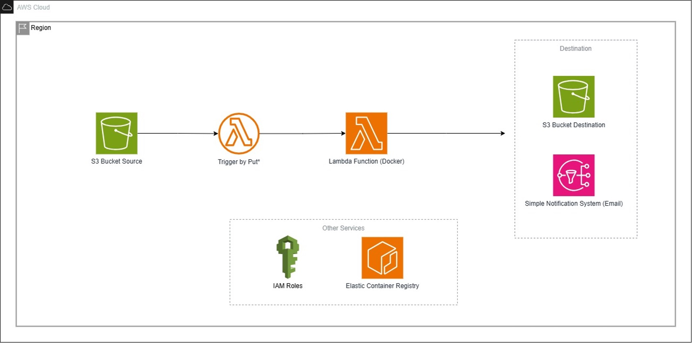

```
#######                  ######                                        ######                                                  
   #    #    # ######    #     #  ####   ####  #    # ###### #####     #     # #        ##   #   # #####   ####   ####  #    # 
   #    #    # #         #     # #    # #    # #   #  #      #    #    #     # #       #  #   # #  #    # #    # #    # #   #  
   #    ###### #####     #     # #    # #      ####   #####  #    #    ######  #      #    #   #   #####  #    # #    # ####   
   #    #    # #         #     # #    # #      #  #   #      #####     #       #      ######   #   #    # #    # #    # #  #   
   #    #    # #         #     # #    # #    # #   #  #      #   #     #       #      #    #   #   #    # #    # #    # #   #  
   #    #    # ######    ######   ####   ####  #    # ###### #    #    #       ###### #    #   #   #####   ####   ####  #    # 
```


<p align="center">


</p>

## 📍Table of Contents
* 👋 [Overview](#-overview)
* ✅ [Dependencies](#-dependencies)
* 🌵 [File Structure](#-file-structure)
* 💾 [Data](#-data)
* 🏃 [Preliminary Steps](#-preliminary-steps)
  * [☁️ AWS](#-aws)
  * [GitHub Actions](#github-actions)
* 🚀 [Getting Started](#getting-started)
  * [🐳 Docker](#-docker)
  * [🪨 Terraform](#-terraform)
* 📑 [Resources](#-resources)


## 👋 Overview
Visualize this! You’re on the field with less than 30 seconds in the 4th quarter. You’re juggling dependencies, battling inconsistent environments and scrambling to get your model into the end zone. You need a way to streamline your pipeline to win. This is when you decide to pull out the “Docker Playbook”, the ultimate game plan! In this seminar, we are going to take a deep dive in turning our Xs and Os into writing efficient Dockerfiles, containerizing our models and distributing them to our peers and the cloud.  At the end of the final whistle, you will have the skills to build scalable, portable and efficient pipelines that are built to win.

Slides for this workshop is located [here](https://github.com/thestrugglingblack/the-docker-playbook/blob/main/The%20Docker%20Playbook%20-%20A%20Walkthrough%20on%20Using%20Docker%20for%20Model%20Pipelines.pdf).

[](https://www.linkedin.com/in/zuri-hunter-748ba514)
[](https://x.com/ZuriHunter)
[](https://github.com/thestrugglingblack)

<p align="center">
  
</p>

## ✅ Dependencies
* [Docker](https://www.docker.com/get-started/)
* [Python (v3)](https://www.python.org/downloads/)
* [Terraform](https://developer.hashicorp.com/terraform/install)
* [AWS Account](https://docs.aws.amazon.com/accounts/latest/reference/manage-acct-creating.html)


## 🌵 File Structure
```txt
├── LICENSE
├── README.md
├── model
│   ├── Dockerfile
│   ├── model.py
│   └── requirements.txt
├── terraform
│   └── lambda
│       ├── ecr.tf
│       ├── iam_ecr.tf
│       ├── iam_lambda.tf
│       ├── lambda.tf
│       ├── providers.tf
│       ├── sns.tf
│       └── s3.tf
└── utils
    ├── aws-user-managed-policy.json
    ├── ecr-login.sh
    └── tracking-trigger-file.csv
```
## 💾 Data
The data that we are going to work with uses the dataset from the NFL Big Data Bowl 2025. The data is about 8GB large but the files that wee will only need are `tracking*.csv`. You can download the zipped version from [here](https://www.kaggle.com/competitions/nfl-big-data-bowl-2025/data).

##  🏃 Preliminary Steps
In these steps you will have your AWS account prepared.

### ☁️ AWS
1. With the current AWS account that you have add this policy to your permissions. This will give your account the ability to create S3, Lambda, IAM, Cloudwatch and ECR resources.
```
{
  "Version": "2012-10-17",
  "Statement": [
    {
      "Effect": "Allow",
      "Action": [
        "s3:CreateBucket",
        "s3:PutBucketNotification",
        "s3:GetBucketNotification",
        "s3:PutObject",
        "s3:GetObject",
        "s3:ListBucket",
        "lambda:CreateFunction",
        "lambda:UpdateFunctionCode",
        "lambda:UpdateFunctionConfiguration",
        "lambda:DeleteFunction",
        "lambda:AddPermission",
        "lambda:RemovePermission",
        "iam:CreateRole",
        "iam:AttachRolePolicy",
        "iam:PassRole",
        "iam:DeleteRole",
        "iam:DetachRolePolicy",
        "logs:CreateLogGroup",
        "logs:CreateLogStream",
        "logs:PutLogEvents",
        "ecr:CreateRepository",
        "ecr:PutImage",
        "ecr:DescribeRepositories",
        "ecr:GetAuthorizationToken",
        "sts:GetCallerIdentity",
        "ec2:DescribeRegions"
      ],
      "Resource": "*"
    }
  ]
}
```
> Note 📝: Your user should be able to use AWS CLI this will be needed to run Terraform commands.

For further assistance on how to do this follow these resources below:
* [Create AWS User](https://docs.aws.amazon.com/IAM/latest/UserGuide/id_users_create.html)
* [Change AWS User Permissions](https://docs.aws.amazon.com/IAM/latest/UserGuide/id_users_change-permissions.html)
* [Configuration and credential file settings in the AWS CLI](https://docs.aws.amazon.com/cli/v1/userguide/cli-configure-files.html)

> Note 📝: You can copy the contents of the items above within `utils/aws-user-managed-policy.json`.

2. Create a S3 bucket that you will use to hold the source data. That is what you will use to replace in the `s3.tf` file.
 
### 💥GitHub Actions
Add the following environment variables under **Project** **Settings** > **Secrets** **and** **Variables** > **Actions**.
```
DOCKER_HUB_USERNAME
DOCKER_HUB_PASSWORD
AWS_ACCESS_KEY_ID
AWS_SECRET_ACCESS_KEY
```
The environment variables above will allow you to push the docker image of your model Docker Hub and your AWS Elastic Container Registry.
> Note 📝: The Elastic Container Registry must be made prior to GitHub Actions pipeline launching got to "Getting Started" to create the Elastic Container Registry.

3. Replace `378737770782` with your account ID in `.github/workflows/model_docker.yml`.

```yml
        run: |
          aws lambda update-function-code \
            --function-name tdp-model-docker \
            --image-uri  378737770782.dkr.ecr.us-east-1.amazonaws.com/tdp/the-docker-playbook-model:latest # <----- Replace with your AWS Account ID
```

## 🚀 Getting Started
Verify that you have both Docker and Terraform installed by running `docker -v` and `terraform -v`.

### 🪨 Terraform 
Before deploying our infrastructure we will have to make some small changes to a series of files.

#### AWS Account Number
Replace all instances of `378737770782` with your account number. 

#### Simple Notification System (SNS)
Replace all instances of `thestrugglingblack@gmail.com` with your email.

#### S3
In `terraform/lambda/s3.tf` change everything that says **the-docker-playbook-data** to what you named your S3 bucket.

```terraform
# Retrieve S3 "the-docker-playbook-data" arn
data "aws_s3_bucket" "tdp_data" {
  bucket = "the-docker-playbook-data" # <----------- HERE
}

# Allow S3 to invoke Lambda
resource "aws_lambda_permission" "tdp_lambda_s3_invoke_permission" {
  statement_id = "AllowS3Invoke"
  action        = "lambda:InvokeFunction"
  function_name = aws_lambda_function.tdp_model_lambda.function_name
  principal     = "s3.amazonaws.com"
  source_arn = "arn:aws:s3:::the-docker-playbook-data" # <----------- HERE but it should read arn:aws:s3:::NAME_OF_YOUR_BUCKET
}
```

After those updates have been completed follow these steps below:
1. Change into the directory of `terraform/lambda`.
2. Run `terraform init` to initialize the stack.
3. Run `terraform apply -target=aws_ecr_repository.tdp_model_ecr` to create your ECR stack alone. 


Verify that everything was deployed successfully by:
* Go to Elastic Container Registry (ECR) and see if  `tdp/the-docker-playbook-model` was created.


### 🐳 Docker
In this workshop there are two ways to push the model docker image to **ECR** and **DockerHub**: GitHub Actions and CLI. 
> Note 📝: Replace <INSERT_REGION> with the AWS region your account is located (default: us-east-1) and replace <INSERT_ACCOUNT_ID> with your AWS account ID.

1. First authenticate with ECR:

```bash
aws ecr get-login-password --region <INSERT_REGION> | docker login --username AWS --password-stdin <INSERT_ACCOUNT_ID>.dkr.<INSERT_REGION>.amazonaws.com
```
2. Change into the directory of where the model is located `cd model/`.

2. Build the docker image:
```bash
docker build -t <INSERT_ACCOUNT_ID>.dkr.ecr.<INSERT_REGION>.amazonaws.com/tdp/the-docker-playbook-model:latest .
```

3. Push the new built docker image to ECR:
```bash
docker push <INSERT_ACCOUNT_ID>.dkr.ecr.<INSERT_REGION>.amazonaws.com/tdp/the-docker-playbook-model:latest
```

3. Now the rest of the stack can be ran `terraform apply` to apply and deploy your changes to AWS.

Verify that everything was deployed successfully by:
* Go to Lambda and see if `tdp-model-docker` function was created.
* Go to SNS and see if `tdp-lambda-failure-topic` and `tdp-lambda-success-topic` was created.

4. To destroy your pipeline run, `terraform destroy`.

#### OPTIONAL: Test Image Locally
1. First build and tag the docker image under a different name.

```bash
docker build -t  tdp/the-docker-playbook-model-test
```
2. Run the container and replace everything <INSERT_*> with what you is defined in your `lambda.tf` file.

```bash
docker run -e S3_BUCKET_NAME=<INSERT_BUCKET_NAME> -e DATA_FOLDER=<INSERT_DATA_FOLDER> \
  -e RESULTS_FOLDER=<INSERT_RESULTS_FOLDER> -e MODEL_FOLDER=<INSERT_MODEL_FOLDER> \
  -p 9000:8080 tdp/the-docker-playbook-model-test
```

3. Run a curl command to invoke the function and verify that there is a status code of 200.
```bash
curl -XPOST "http://localhost:9000/2015-03-31/functions/function/invocations" \
  -d '{}'
```

## 🪄Activate The Model Pipeline
To trigger your Lambda function upload one of the tracking files into your S3 bucket.

> Note 📝: To receive the email notification you must hit the subscribe button that was sent to the email added.

## 📑 Resources
* [Terraform Tutorial](https://spacelift.io/blog/terraform-tutorial)
* [Docker Tutorial For Beginners](https://www.youtube.com/watch?v=fqMOX6JJhGo)
